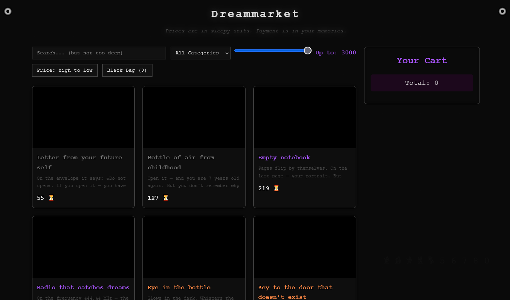

## Dreammarket

A surreal experimental web project inspired by dreamcore aesthetics,
blending elements of e-commerce with abstract and uncanny concepts.

---
## About

It is a conceptual project where users can explore and “purchase”
strange, impossible, and dream-like objects such as:

* Eyes in the bottle
* Shadows in boxes
* Mirrors without reflection
* and other surreal artifacts

The project focuses on atmosphere, interaction, and visual style rather than real transactions.

---

## Preview

  

---

## Features

* Search system
* Price range slider
* Sorting (low → high / high → low)
* 9 product categories
* Unique item rarity system
* Dark dreamcore-inspired UI

---
## How to Run

1 - Easy Way

Download or clone the repository

Open the folder

Run the index.html file in your browser

2 - Git
`git clone https://github.com/soykoulen/Dreammarket.git`
`cd Dreammarket`

Then open index.html in your browser.
---

## Tech Stack

    HTML
    CSS
    JavaScript

---
